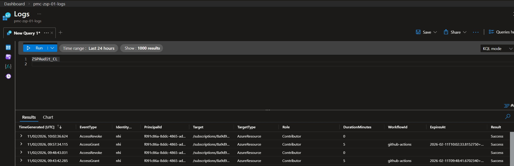

# Use Zero Standing Privilege Gateway with GitHub Actions

## Introduction

This repo is to test the use of Zero Standing Privilege (ZSP) Gateway with GitHub Actions. The ZSP Gateway is a tool that allows human operators, service principals and AI Agents to securely access Azure resources without requiring permanent standing privileges. The workflow will request access to the resource, and the ZSP Gateway will grant time limited access to the resource.

The Zero Standing Privilege Gateway was made by Jerrad Dahlager, More information about the ZSP Gateway and how to deploy it can be found in his GitHub repo [zsp-azure-lab](https://github.com/j-dahl7/zsp-azure-lab) and linked [blog post](https://nineliveszerotrust.com/blog/zero-standing-privilege-azure/).

Access for service principals is based on assigning the Azure IAM role directly to the service principal.<br>
Human operator access is granted by adding the user to an Entra group that has the required role assignment.<br><br>

When the function app grants access, it will start a revocation timer, which will automatically remove the access after the specified duration.  The function app will also log the access request and revocation in Log Analytics.

## Requirements

You need to have the ZSP Gateway Function App deployed and configured.

You will need to create a service principal in your Entra/Azure environment for the GitHub Actions workflow. I used my PowerShell script to create a new service principal with OIDC federated credentials, This script will create the role assignment on the target scope automatically.  I manually removed it to carry out this test.  The PowerShell script can be found [here](https://github.com/paul-mccormack/actions-entra-auth).

The Function App Identity must have User Access Administrator role applied to the scope where it will be managing access.<br>
In this test, the Function App will be managing access to my sandbox subscription.

## GitHub Repository Setup

The following Github Repo Secrets will need to be created:

| Secret Name | Description |
|-------------|-------------|
|AZURE_CLIENT_ID | The client ID of the service principal that was created for the GitHub Actions workflow. |
|AZURE_SP_OBJECT_ID | The object ID of the service principal that was created for the GitHub Actions workflow. |
|AZURE_TENANT_ID | The tenant ID of the Entra/Azure environment. |
|AZURE_SUBSCRIPTION_ID | The ID of the target Azure subscription. |
|AZURE_FUNCTION_KEY | The function key for the ZSP Gateway Function App. |
|AZURE_FUNCTION_URL | The URL of the ZSP Gateway Function App. |

## Triggering the function app to grant access

The function app is triggered by a HTTP POST request. The snips below show examples of how to trigger the function app for both human operator access and service principal access in both PowerShell and bash.

### Human Operator

> [!NOTE]
> I haven't used references to GitHub Secrets in the human operator examples below as I would expect this feature would be used by the operator in a terminal.  The human operator examples are just to show how it's done.

In bash:

```bash
curl -X POST "https://<Azure Function App URL>/api/admin-access" \
  -H "Content-Type: application/json" \
  -H "x-functions-key: <Azure Function App key>" \
  -d '{
    "user_id": "Entra User Object ID",
    "group_id": "Entra Group Object ID",
    "duration_minutes": 10,
    "justification": "Testing123456"
  }'
```

In PowerShell:

```powershell
$uri = "https://<Azure Function App URL>/api/admin-access"
$headers = @{
    "Content-Type"="application/json"
    "x-functions-key"="<Azure Function App key>"
}
$body = @{
    "user_id"="Entra User Object ID"
    "group_id"="Entra Group Object ID"
    "duration_minutes"=10
    "justification"="Testing123456"
} | ConvertTo-Json

Invoke-WebRequest -Uri $uri -Method "POST" -Headers $headers -Body $body
```
### Service Prinicipal

In bash:

```bash
curl -X POST "${{ secrets.AZURE_FUNCTION_URL }}/api/nhi-access" \
  -H "Content-Type: application/json" \
  -H "x-functions-key: ${{ secrets.AZURE_FUNCTION_KEY }}" \
  -d '{
    "sp_object_id": "${{ secrets.AZURE_SP_OBJECT_ID }}",
    "scope": "/subscriptions/${{ secrets.AZURE_SUBSCRIPTION_ID }}",
    "role": "Contributor",
    "duration_minutes": 10,
    "workflow_id": "github-actions"
    }'
```
In PowerShell:

```powershell
$uri = "https://${{ secrets.AZURE_FUNCTION_URL }}/api/nhi-access"
$headers = @{
    "Content-Type"="application/json"
    "x-functions-key"="${{ secrets.AZURE_FUNCTION_KEY }}"
}
$body = @{
    "sp_object_id"="${{ secrets.AZURE_SP_OBJECT_ID }}"
    "scope"="/subscriptions/${{ secrets.AZURE_SUBSCRIPTION_ID }}"
    "role"="Contributor"
    "duration_minutes"=10
    "workflow_id"="github-actions"
} | ConvertTo-Json

Invoke-WebRequest -Uri $uri -Method "POST" -Headers $headers -Body $body
```

See the worklow file in this repo for an example of how to trigger the function app to grant a service principal access: [.github/workflows/deploy.yml](.github/workflows/deploy.yml)

## Looking at the logs

From the GitHub Actions workflow we can see the identity successfully using the Function App to get a role assignment:

```bash
Run curl -X POST "https://***/api/nhi-access" \
  curl -X POST "https://***/api/nhi-access" \
    -H "Content-Type: application/json" \
    -H "x-functions-key: ***" \
    -d '{
      "sp_object_id": "***",
      "scope": "/subscriptions/***",
      "role": "Contributor",
      "duration_minutes": 5,
      "workflow_id": "github-actions"
      }'
  shell: /usr/bin/bash -e {0}
  % Total    % Received % Xferd  Average Speed   Time    Time     Time  Current
                                 Dload  Upload   Total   Spent    Left  Speed

  0     0    0     0    0     0      0      0 --:--:-- --:--:-- --:--:--     0
100   225    0     0  100   225      0    145  0:00:01  0:00:01 --:--:--   146
100   225    0     0  100   225      0     88  0:00:02  0:00:02 --:--:--    88
100   225    0     0  100   225      0     63  0:00:03  0:00:03 --:--:--    63
100   225    0     0  100   225      0     49  0:00:04  0:00:04 --:--:--    49
100   225    0     0  100   225      0     40  0:00:05  0:00:05 --:--:--    40
100   225    0     0  100   225      0     34  0:00:06  0:00:06 --:--:--     0
100   225    0     0  100   225      0     29  0:00:07  0:00:07 --:--:--     0
100   225    0     0  100   225      0     26  0:00:08  0:00:08 --:--:--     0
100   225    0     0  100   225      0     23  0:00:09  0:00:09 --:--:--     0
100   225    0     0  100   225      0     21  0:00:10  0:00:10 --:--:--     0
100   225    0     0  100   225      0     19  0:00:11  0:00:11 --:--:--     0
100   777    0   552  100   225     45     18  0:00:12  0:00:12 --:--:--   119
100   777    0   552  100   225     45     18  0:00:12  0:00:12 --:--:--   152
{"status": "granted", "assignment_id": "/subscriptions/***/providers/Microsoft.Authorization/roleAssignments/60ba996a-4570-4327-bad3-30be63ed20bb", "assignment_name": "60ba996a-4570-4327-bad3-30be63ed20bb", "sp_object_id": "***", "scope": "/subscriptions/***", "role": "Contributor", "expires_at": "2026-02-11T10:02:33.815275+00:00", "duration_minutes": 5, "workflow_id": "github-actions", "orchestrator_instance_id": "c59ca506056b46d8bce00520dffaf0be"}
```
Follwed by a successful login to Azure:

```bash
Run azure/login@v2
  with:
    tenant-id: ***
    client-id: ***
    subscription-id: ***
    enable-AzPSSession: true
    environment: azurecloud
    allow-no-subscriptions: false
    audience: api://AzureADTokenExchange
    auth-type: SERVICE_PRINCIPAL
Running Azure CLI Login.
/usr/bin/az cloud set -n azurecloud
Done setting cloud: "azurecloud"
Federated token details:
 issuer - https://token.actions.githubusercontent.com
 subject claim - repo:paul-mccormack/zsp-github-actions-workflow:ref:refs/heads/main
 audience - api://AzureADTokenExchange
 job_workflow_ref - paul-mccormack/zsp-github-actions-workflow/.github/workflows/deploy.yml@refs/heads/main
Attempting Azure CLI login by using OIDC...
Subscription is set successfully.
Azure CLI login succeeds by using OIDC.
Running Azure PowerShell Login.
{
  Result: '/usr/share/az_14.6.0/Az.Accounts/5.3.2/Az.Accounts.psd1',
  Success: true
}
Federated token details:
 issuer - https://token.actions.githubusercontent.com
 subject claim - repo:paul-mccormack/zsp-github-actions-workflow:ref:refs/heads/main
 audience - api://AzureADTokenExchange
 job_workflow_ref - paul-mccormack/zsp-github-actions-workflow/.github/workflows/deploy.yml@refs/heads/main
Attempting Azure PowerShell login by using OIDC...
{ Success: true, Result: '' }
Running Azure PowerShell Login successfully.
```
Then waiting a few minutes for the access to be revoked you can check the function app logs and see the both the grants and revokes:



## Potential problems and troubleshooting

Azure RBAC operates using "eventual consistency", which results in a delay between the role assignment being created and it being available for use.<br>
This can cause problems for the workflow as it may try to access the resource before the role assignment has propagated, resulting in an access denied error.<br>
To mitigate this, I have added a step in the workflow to wait for 30 seconds after the function app grants access and before the worker attempts to login.  This seems to be enough of a delay to allow a role assignment at a subscriptions scope to propegate but in a complex environment making a role assignment at a Management Group scope can take up to 10 minutes to propegate.<br><br>
Depending on your use case you might need to adjust the delay time to accomodate for this.
